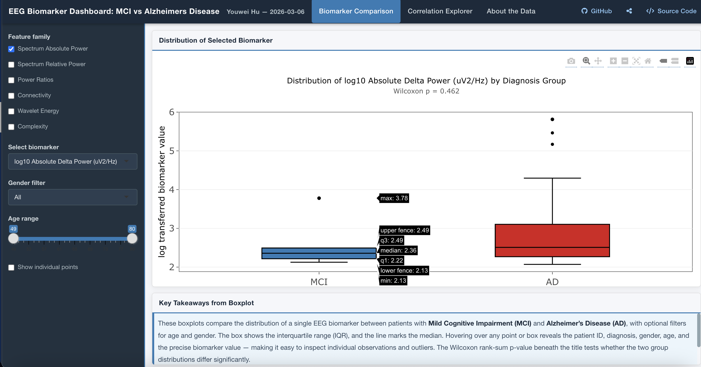

# EEG Biomarker Dashboard for Alzheimer’s Disease

An interactive Shiny dashboard for exploring quantitative EEG (QEEG) biomarkers to differentiate **Alzheimer’s Disease (AD)** and **Mild Cognitive Impairment (MCI)**.

🔗 **Live App:** https://youwei-hu.shinyapps.io/dashboard_app/  
🔗 **GitHub:** https://github.com/hww228/data555_Dashboard  

---
## Dashboard Preview


---

## Project Overview

This project develops an interactive visualization tool to investigate EEG-derived biomarkers for early-stage Alzheimer's disease detection. The dashboard enables dynamic exploration of high-dimensional neurophysiological features, supporting both **group comparison** and **feature relationship analysis**.

## Motivation
Early detection of Alzheimer’s disease remains a major clinical challenge. This project aims to provide a data-driven, non-invasive tool for exploring EEG biomarkers that may improve diagnostic differentiation between MCI and AD.
---

## Key Features

### 1. Biomarker Comparison
- Interactive boxplots comparing AD vs MCI  
- Filters: age, gender, feature family  
- Optional patient-level overlay  
- Real-time Wilcoxon rank-sum test results  

### 2. Correlation Explorer
- Interactive heatmap of feature correlations  
- Adjustable threshold for strong relationships  
- Supports Pearson and Spearman methods  
- Subgroup analysis by diagnosis, age, and gender  

---

## Data Description & Methods

- **Data Source:** Goizueta Brain Health Institute (Emory University)  
- **Sample Size:** 31 participants (AD & MCI)  
- **EEG Setup:** 19 channels (10–20 system), 256 Hz  

### Extracted Features
- Spectral power (absolute & relative)  
- Power ratios  
- Wavelet coherence & energy  
- Complexity metrics  

> Data is confidential and not publicly available.

---

##  Project Structure
```
data555_Dashboard/
├── README.md
├── .gitignore
├── .nojekyll
├── DATA555_dashboard.Rproj
└── dashboard_app/
    ├── shiny_dashboard.Rmd
    ├── dashboard_style.css
    ├── images/
        └── dashboard_previwe.png
    └── data/
        └── patient_data.xlsx
```
---

## How to Run Locally

1. Clone the repository:
```bash
git clone https://github.com/hww228/data555_Dashboard.git
cd data555_Dashboard
```
2. Open in RStudio
3. Run locally:
```r
rmarkdown::run("dashboard_app/shiny_app.Rmd")
```


